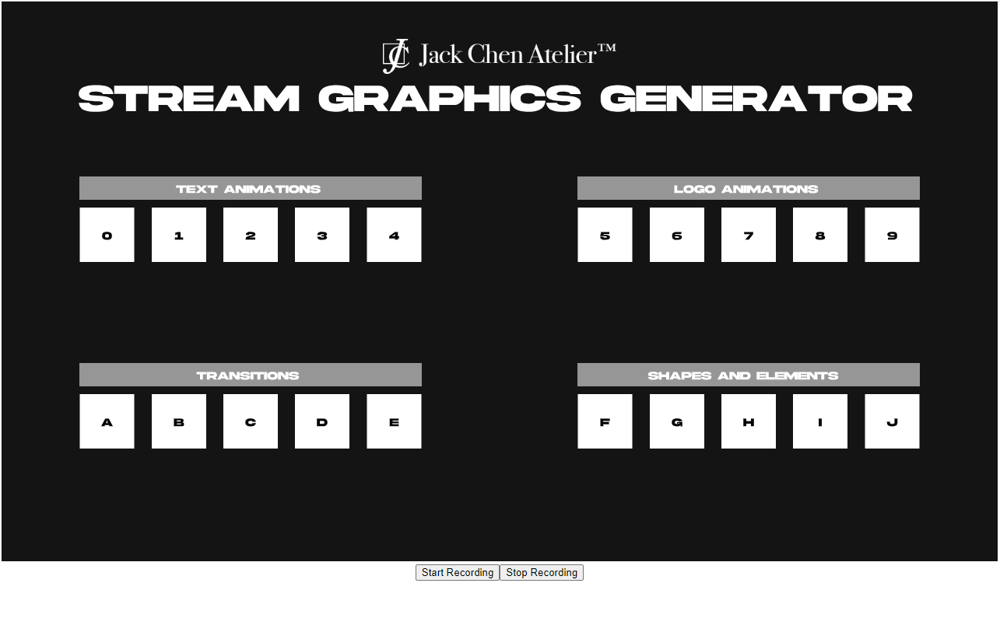
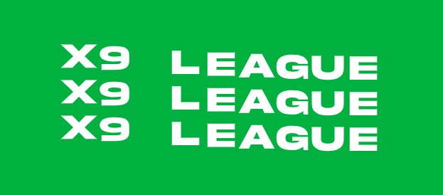
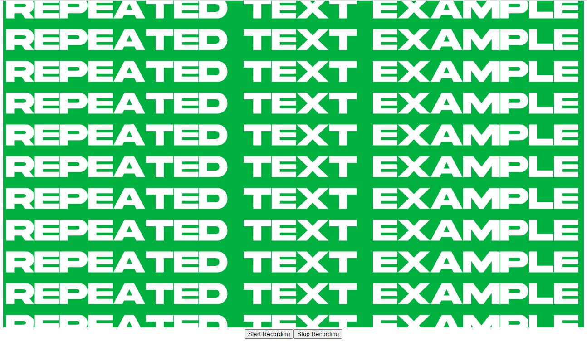

# Creative Programming 2 Final Project
## Twitch Stream Graphics Generator

## Description
This project is a framework to develop animated graphics for Twitch streams. It was designed for myself as a way to organize and save different text animations, stinger transitions, and other graphics a client may request. The current state of this project is designed only for myself, but usability features such as text input and direct WebM export are possible future updates.

P5.js was used for the main menu and the animations. The libraries CCapture and FFMPEG are used to record frames and export them, which would then be edited and chroma keyed in Premiere and exported as a WebM. WebM is a video format that supports transparent backgrounds, perfect for stream overlays.

The menu is navigated using keyboard keys, as marked on each square. Clicking backspace returns you to the menu.

The background color is set to green by default for easy chroma keying in Premiere.

One application of this program is Stinger Transitions. Shown below is an example of a basic one:

