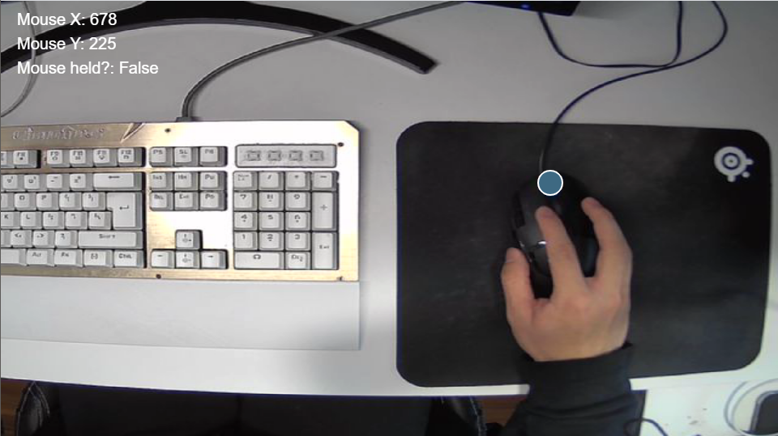
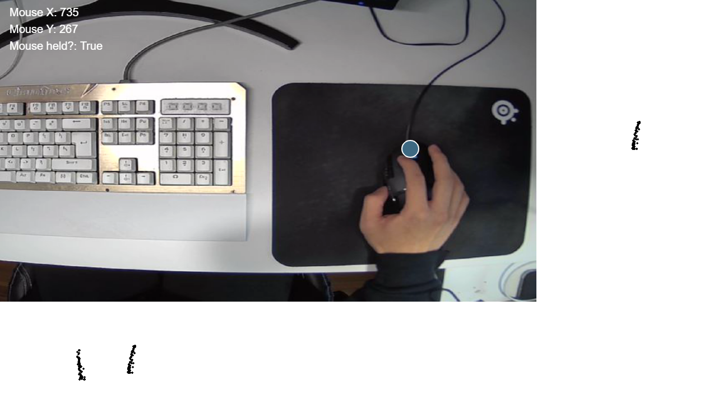
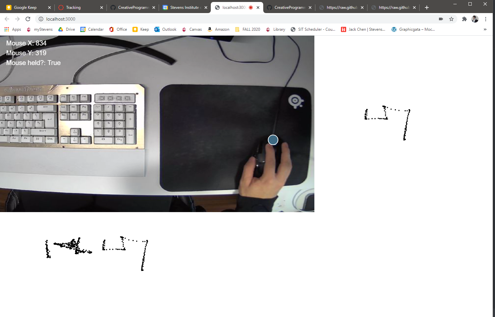
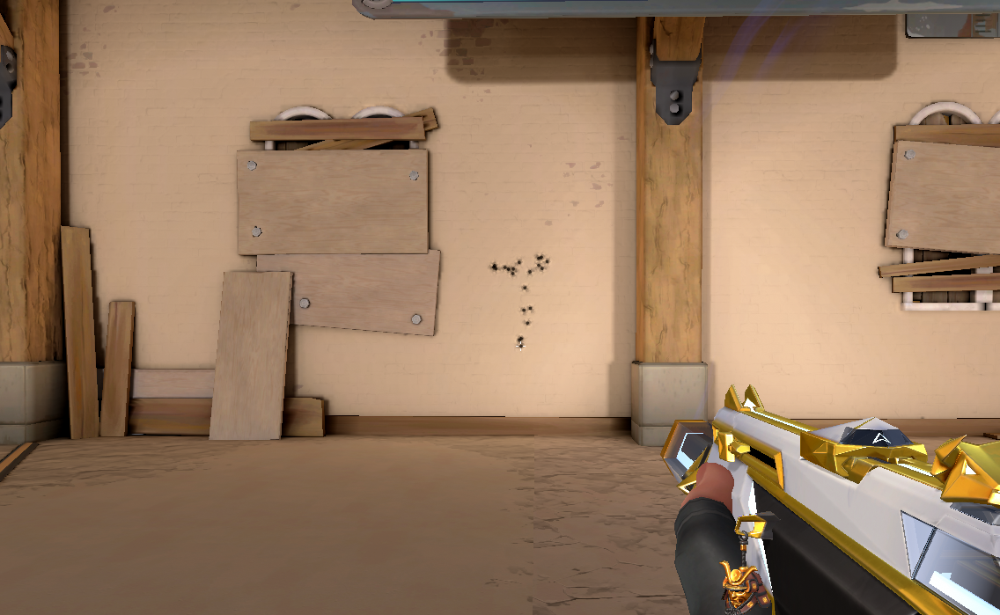
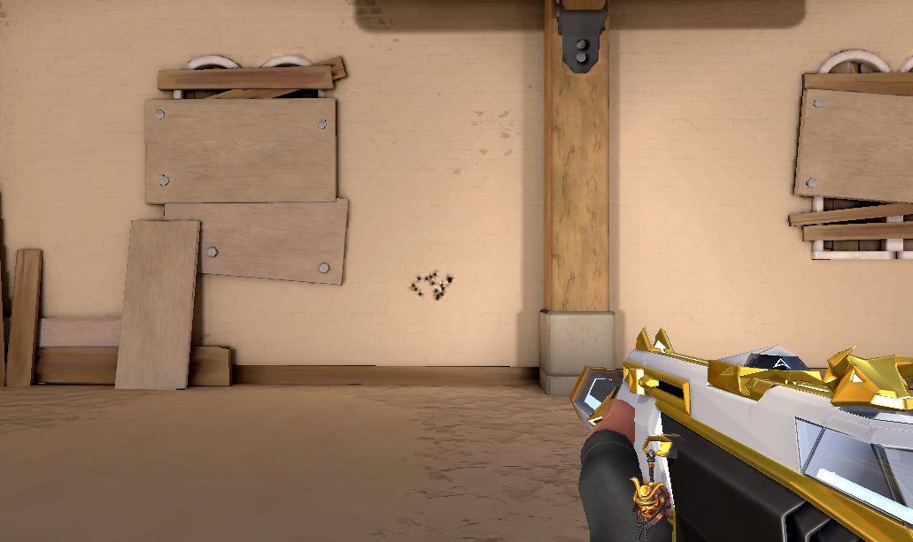

# Homework 4: Webcam Tracking
## Mouse movement tracker to analyze spray control in tactical shooters

## Description
This project utilizes P5js webcam tracking to track mouse movements. A blue sticker attached to the middle of my mouse is tracked by a downward facing webcam using a color tracking algorithm. Mouse movements are drawn in the screen when the mouse button is held, to coincide with actions in games such as Valorant or CS:GO. After the mouse is released, the pattern drawn is shown at the bottom of the screen for analysis.

## Disclaimer
Unfortunately, due to the limits of P5js and Javascript, the program isn't able to read mouse clicks when the user is outside the browser window. Although this basically renders this project useless, you can imagine how it could work if it were programmed in the Java version of Processing or Python, for example.

Bullet spray pattern of the Phantom without control. (Valorant)

Bullet spray pattern of the Phantom with decent control. (Valorant) You do this by moving your mouse downwards to counteract the bullets moving up.
